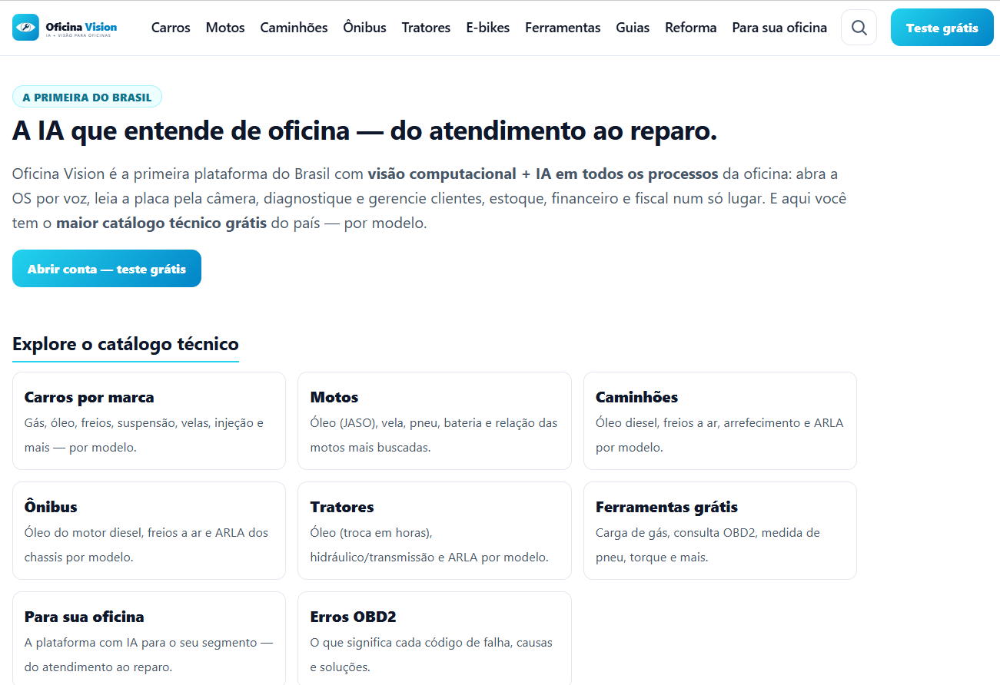
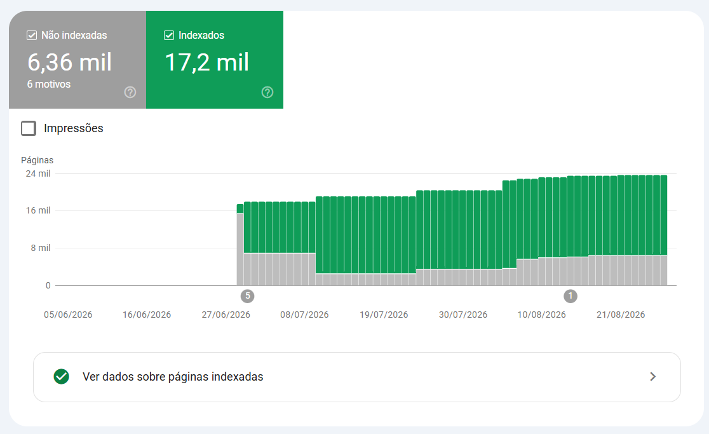
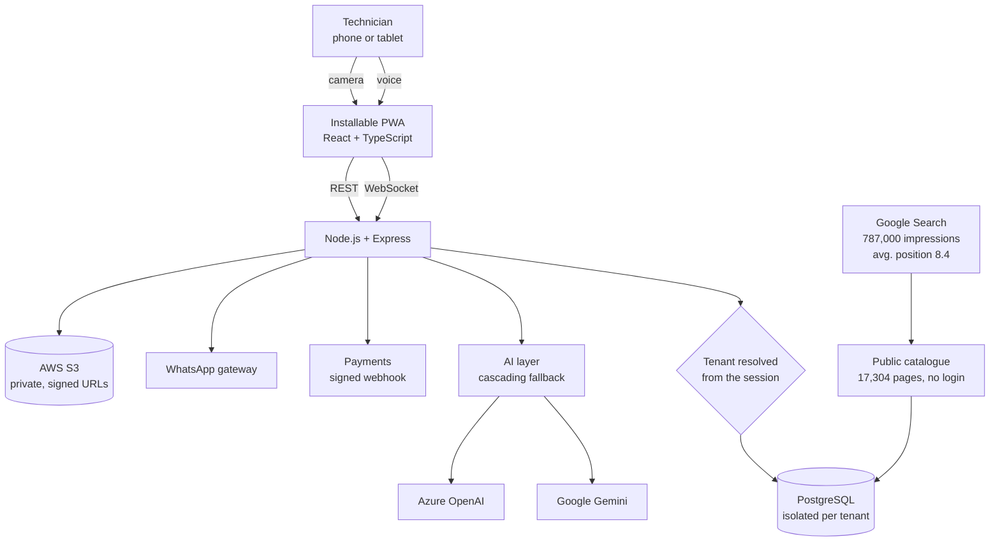
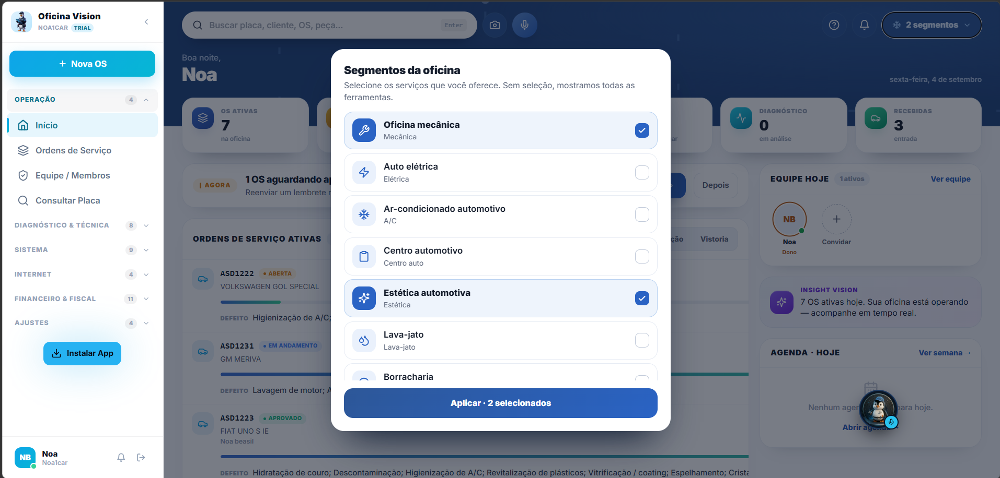
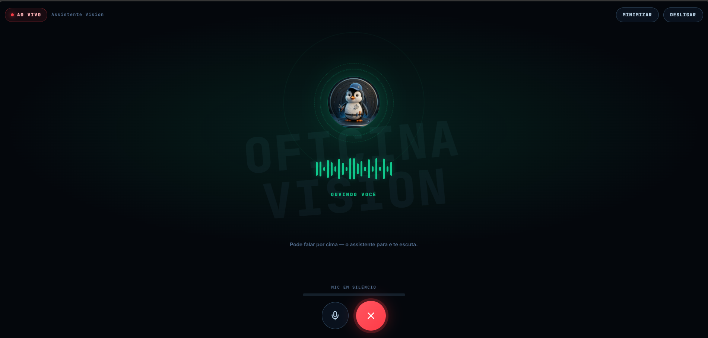

# Oficina Vision

Two things sharing one engine: a **free public catalogue** of technical defects and tools for
a wide range of vehicles, and the **multi-tenant platform** behind it, where work orders are
opened and filled by voice.

> **This is a case study, not the source.** The product is commercial and its repository is
> private. What follows is the architecture and the engineering decisions, written so they
> can be read and questioned.
>
> Catalogue: **[oficinavision.com.br](https://oficinavision.com.br)**
> Platform: **[app.oficinavision.com.br](https://app.oficinavision.com.br)**

| | |
|---|---|
| Catalogue pages published, free and without login | **17,304** |
| Google Search impressions, first 3 months | **787,000** |
| Clicks from search, same period | **3,960** |
| Average position in Google Search | **8.4** — first page, on average |
| Workshops testing the platform, across 5 states | **17** |
| Work orders in 6 months | **33,000+** (created in the system and migrated through integration) |
| Business segments served by the same codebase | **14**, through configuration, no fork |

---

## Two problems, one engine

**The mechanic's problem.** A mechanic has a phone on their shoulder and dirty hands. Typing
a work order is the part of the job nobody does while the car is on the lift — so it gets
written later, from memory, badly, or not at all. Everything downstream (billing, history,
warranty) inherits that gap. The platform's whole premise is removing the keyboard from the
moment of work.

**Everyone else's problem.** The technical information a mechanic needs — which fuse, which
torque, which known defect on that engine — sits behind paywalls, in PDFs, or in a WhatsApp
group. The catalogue puts it on the open web: no login, no paywall, enriched every month,
and today one of the larger free defect catalogues in Brazil by page count.

The catalogue is not a marketing funnel bolted onto the product. It is the product's public
half, and it is what brings people to the platform.

## What the search data says

Three months of Google Search Console, from the domain's first indexed day in June 2026:

- **787,000 impressions** and **3,960 clicks**
- **Average position 8.4** — first page, on average
- Close to zero in June, around 20,000 impressions a day by September
- **17,200 pages indexed**

The average position is the number worth looking at. A three-month-old domain sitting on page
one is not luck: it is what happens when every page answers one real question, nothing thin
gets indexed, and the internal linking leaves no orphans.

### About the 6,360 pages Google did not index

They are supposed to be there. Their status is **"alternate page with proper canonical tag"**
— Google found each one, followed the canonical I declared, and folded it into the page that
should rank.

The catalogue generates alternates on purpose: the same defect is reachable by model, by
engine and by year, because that is how a mechanic actually searches. Those routes must exist
for people and must not compete with each other for Google. Exactly one of them is canonical,
and 6,360 URLs sitting under that status is the evidence that the canonical tags are doing
their job rather than a backlog to clear.

The arithmetic closes: **17,200 indexed plus 6,360 alternates** is every URL Google knows on
the domain, against the **17,304 canonical pages** the build publishes.

## How it fits together

## Decisions worth defending

**Tenant comes from the session, never from the client.** Every query filters by
organisation, resolved server-side from the token. A resource belonging to another tenant
returns 404, not 403 — a 403 confirms the resource exists, which is itself a leak. Role and
membership are revalidated against the database on each request, so revoking access is
instant rather than eventual.

**The catalogue publishes only verified content.** A page with nothing real on it gets
`noindex` rather than being shipped to pad the count. The build fails if it produces a broken
link or an orphan page. And no page carries a licence plate, a chassis number, or anything
that identifies a person or their vehicle — a public catalogue of defects must never become a
public catalogue of owners.

**The logged-in area is blocked in `robots.txt`.** 17,304 public pages and a customer portal
live on the same domain family. The mistake that quietly indexes the portal is one line of
configuration away, so the block is explicit and checked.

**One codebase, fourteen segments.** Mechanics, car wash, detailing and eleven others differ
in vocabulary, catalogue and workflow — not in architecture. They are configuration profiles
over the same components, behind a kill switch. Forking the code per segment would have been
faster once and unmaintainable forever.

**AI adds, never blocks.** The voice and vision features run through a cascade of provider
and model fallbacks. If every one of them fails, the work order still opens — the technician
types it, as they always could. No feature is allowed to make the core flow depend on a third
party being up.

**Licence plate reading returns masked data.** The camera reads the plate to look up
technical specifications. It does not publish the plate, the chassis, or anything that
identifies the vehicle's owner.

## Stack

`TypeScript` `React` `Node.js` `Express` `PostgreSQL` `Prisma` `Docker` `AWS S3`
`Cloudflare` `Google Gemini` `Azure OpenAI` `WebSocket` `PWA`

## Status

In production, with 17 workshops across 5 states testing the platform. Subscription,
recurring billing and refunds are handled in-app, with prices recalculated on the server and
card data never stored. Installable as a PWA on Android and iOS. The catalogue grows every
month.

---

<b>Português</b>

 

Duas coisas dividindo o mesmo motor: um **catálogo público e gratuito** de defeitos técnicos e
ferramentas para uma faixa larga de veículos, e a **plataforma multi-tenant** por trás dele,
onde a ordem de serviço é aberta e preenchida por voz.

> **Isto é um estudo de caso, não o código.** O produto é comercial e o repositório dele é
> privado. O que está aqui é a arquitetura e as decisões de engenharia, escritas para serem
> lidas e questionadas.
>
> Catálogo: **[oficinavision.com.br](https://oficinavision.com.br)**
> Plataforma: **[app.oficinavision.com.br](https://app.oficinavision.com.br)**

| | |
|---|---|
| Páginas de catálogo publicadas, grátis e sem login | **17.304** |
| Impressões no Google, primeiros 3 meses | **787.000** |
| Cliques vindos da busca, no mesmo período | **3.960** |
| Posição média no Google | **8,4** — primeira página, na média |
| Oficinas testando a plataforma, em 5 estados | **17** |
| Ordens de serviço em 6 meses | **33.000+** (geradas no sistema e migradas por integração) |
| Segmentos atendidos pela mesma base de código | **14**, por configuração, sem fork |

#### Dois problemas, um motor

**O problema do mecânico.** Ele está com o celular no ombro e a mão suja. Digitar ordem de
serviço é a parte do trabalho que ninguém faz com o carro no elevador — então ela é escrita
depois, de memória, mal, ou não é escrita. Tudo que vem depois (faturamento, histórico,
garantia) herda esse buraco. A premissa da plataforma inteira é tirar o teclado do momento do
trabalho.

**O problema de todo o resto.** A informação técnica de que o mecânico precisa — qual fusível,
qual torque, qual defeito conhecido naquele motor — está atrás de paywall, dentro de PDF, ou
num grupo de WhatsApp. O catálogo põe isso na web aberta: sem login, sem paywall, enriquecido
todo mês, e hoje um dos maiores catálogos gratuitos de defeitos do Brasil em número de
páginas.

O catálogo não é funil de marketing pendurado no produto. Ele é a metade pública do produto, e
é o que traz gente para a plataforma.

#### O que o dado de busca diz

Três meses de Google Search Console, desde o primeiro dia indexado do domínio, em junho de
2026:

- **787.000 impressões** e **3.960 cliques**
- **Posição média 8,4** — primeira página, na média
- Perto de zero em junho, cerca de 20.000 impressões por dia em setembro
- **17.200 páginas indexadas**

A posição média é o número que vale olhar. Domínio de três meses ocupando a primeira página
não é sorte: é o que acontece quando cada página responde uma pergunta real, nada raso é
indexado, e a ligação interna não deixa página órfã.

##### Sobre as 6.360 páginas que o Google não indexou

Elas têm que estar ali. O status delas é **"página alternativa com tag canônica adequada"** —
o Google achou cada uma, seguiu a canônica que eu declarei, e dobrou no destino que deve
ranquear.

O catálogo gera alternativas de propósito: o mesmo defeito é alcançável por modelo, por motor e
por ano, porque é assim que o mecânico busca de verdade. Esses caminhos precisam existir para
as pessoas e não podem competir entre si no Google. Exatamente uma delas é a canônica, e 6.360
URLs sob esse status são a prova de que as canônicas estão fazendo o trabalho delas, não uma
fila para limpar.

A conta fecha: **17.200 indexadas mais 6.360 alternativas** é tudo que o Google conhece no
domínio, contra as **17.304 páginas canônicas** que o build publica.

#### Decisões que eu defendo

**O tenant vem da sessão, nunca do cliente.** Toda consulta filtra por organização, resolvida
no servidor a partir do token. Recurso de outro tenant devolve 404, não 403 — um 403 confirma
que o recurso existe, e isso já é vazamento. Papel e vínculo são revalidados no banco a cada
requisição, então revogar acesso é instantâneo.

**O catálogo publica só conteúdo verificado.** Página sem nada de real dentro recebe
`noindex` em vez de ir para o ar engordando a contagem. O build quebra se gerar link quebrado
ou página órfã. E nenhuma página carrega placa, chassi, ou qualquer coisa que identifique uma
pessoa ou o veículo dela — catálogo público de defeitos não pode virar catálogo público de
donos.

**A área logada é bloqueada no `robots.txt`.** 17.304 páginas públicas e um portal de cliente
convivem na mesma família de domínio. O erro que indexa o portal sem ninguém perceber está a
uma linha de configuração de distância, então o bloqueio é explícito e conferido.

**Uma base de código, quatorze segmentos.** Mecânica, lava-jato, estética e outros onze
diferem em vocabulário, catálogo e fluxo — não em arquitetura. São perfis de configuração
sobre os mesmos componentes, atrás de kill-switch. Forkar o código por segmento seria mais
rápido uma vez e insustentável para sempre.

**IA acrescenta, nunca bloqueia.** Voz e visão passam por uma cascata de fallback entre
provedores e modelos. Se todos falharem, a ordem de serviço abre do mesmo jeito — o técnico
digita, como sempre pôde. Nenhuma funcionalidade pode fazer o caminho principal depender de um
terceiro estar de pé.

**A leitura de placa devolve dado mascarado.** A câmera lê a placa para buscar a ficha
técnica. Ela não publica placa, chassi, nem nada que identifique o dono do veículo.

#### Situação

Em produção, com 17 oficinas em 5 estados testando a plataforma. Assinatura, cobrança
recorrente e estorno resolvidos dentro do app, com preço recalculado no servidor e dado de
cartão nunca armazenado. Instalável como PWA no Android e no iOS. O catálogo cresce todo mês.

